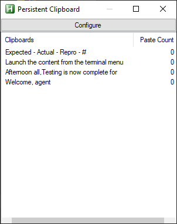

# PersistentClipboard

**// About this project //**

I often found myself having to type the same things over and over again - nobody ever said that Software Testing isn't repetitive.

With this in mind, I set out to create a simple app for myself that contains a constant list of strings that might come in handy throughout the day. Things like email greetings, sign-offs and in my case - a pre-formatted Bug Report containing some of the words I write most frequently every day.

It has been a while since I worked on this or even used it to be honest, but the app is currently hard-coded to automatically pop-up whenever a 'Jira' web-browser window is detected as this was my primary use-case for the app. 

It *can* be summoned manually, but it will automatically appear whenever the designated window is active.

# Future Developments

The app is only barely functional as it is right now, and the way that the pre-defined are stored in Strings.txt is not very intuitive for a user to manually edit.

Maybe it'll all get fixed in the future? Pray for me.